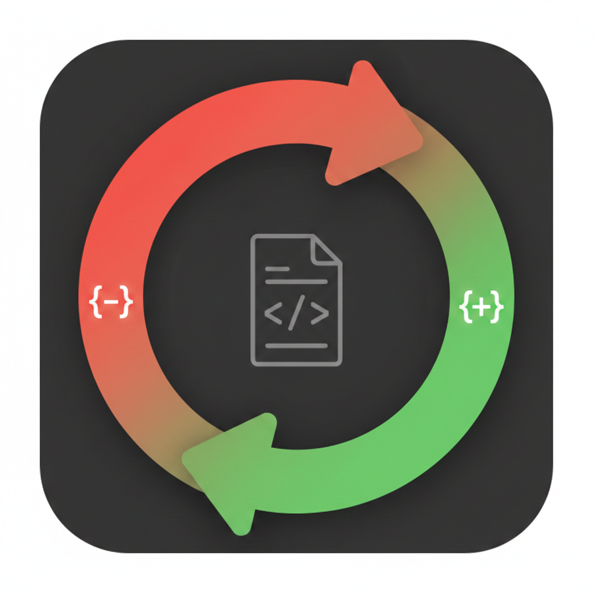
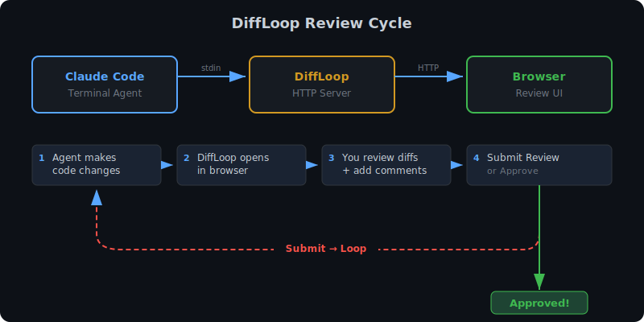
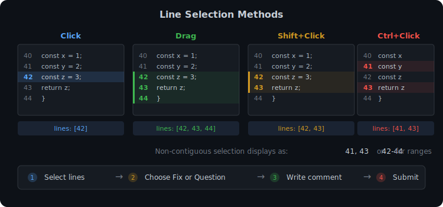
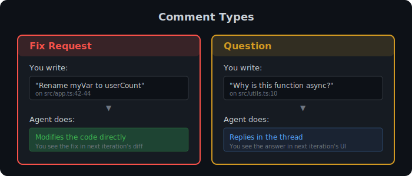

# DiffLoop



> Interactive code review UI for AI coding agents

**Bun 1.3+** | **Preact** | **diff2html** | **TypeScript**

---

DiffLoop opens a browser-based diff viewer where you can leave inline comments on code changes made by an AI agent. The agent reads your feedback, fixes the code, answers questions, and re-opens DiffLoop — creating a review loop until you approve.

Think of it as a **local GitLab MR review** — but for your terminal AI workflow.

## How It Works



```
Agent makes changes → tries to commit
        ↓
  Hook intercepts → DiffLoop opens in browser
        ↓
  You review diffs, leave comments (Fix / Question)
        ↓
  ┌── Submit Review ──→ Commit blocked, agent gets feedback
  │                      Agent fixes code, tries to commit again
  │                      Hook fires again → you see new diffs
  │                      Loop until satisfied
  │
  └── Approve ─────────→ Commit proceeds
```

## Features

- **Pre-commit hook** — automatically opens on `git commit`, blocks until approved
- **Inline comments** — click any line number to add a Fix request or Question
- **Multi-line selection** — drag, Shift+click (range), Ctrl+click (toggle individual lines)
- **Thread conversations** — agent responses appear inline, continue the discussion across iterations
- **Markdown support** — toolbar with bold, italic, strikethrough, inline code, code blocks, links, blockquotes, bullet/numbered/task lists; messages render with inline markdown formatting
- **Resolve / Reopen** — mark threads as done, reopen if needed
- **Side-by-side & unified** diff view modes
- **File tree sidebar** — navigate files, see comment/response/resolved badges per file
- **Project header** — displays project name, branch, iteration counter, and file count
- **Iteration highlighting** — see what changed since last review
- **Original code context** — thread editor shows the code snippet being discussed
- **Edit & delete** — click any comment indicator to modify or remove
- **Dark theme** — GitHub-dark inspired, easy on the eyes
- **Zero config** — ephemeral server, project-local state in `.diffloop/`

## Quick Start

### Prerequisites

- [Bun](https://bun.sh) 1.3+
- [Claude Code](https://docs.anthropic.com/en/docs/claude-code) (for the pre-commit hook integration)

### Install & Build

```bash
git clone https://github.com/KYONY/diffloop.git && cd diffloop
bun install
bun run build
```

### Integrate with Claude Code

Add DiffLoop as a pre-commit hook in `~/.claude/settings.json`:

```json
{
  "hooks": {
    "PreToolUse": [
      {
        "matcher": "^Bash$",
        "hooks": [
          {
            "type": "command",
            "command": "/bin/bash /path/to/diffloop/scripts/pre-commit-hook.sh",
            "timeout": 1800
          }
        ]
      }
    ]
  }
}
```

Replace `/path/to/diffloop` with the actual installation path. Now every `git commit` by the agent triggers a code review.

See [docs/integration.md](docs/integration.md) for full setup details.

### Run Standalone

```bash
echo '{}' | bun src/cli.ts
```

Opens browser at `http://localhost:<random-port>` with diffs of your current git changes.

## Usage

### Leaving Comments



| Action | Effect |
|--------|--------|
| Click line number | Select single line |
| Drag across line numbers | Select range |
| Shift+click | Extend selection to range |
| Ctrl+click | Toggle individual lines |

After selecting, choose comment type:



- **Fix** — request a code change (agent will modify the code)
- **Question** — ask about the code (agent will answer in the thread)

### Review Actions

| Button | What happens |
|--------|-------------|
| **Submit Review** | Sends feedback to the agent. Agent processes fixes, then re-opens DiffLoop |
| **Approve** | Ends the review loop. Commit proceeds |

### Thread Conversations

When the agent responds to your comments, the thread shows a sequential conversation:

1. **Your comment** — the original fix request or question
2. **Agent response** — what the agent did or answered
3. **Reply form** — continue the conversation if needed

Use **Resolve** to mark a thread as done. Resolved threads appear dimmed and are excluded from feedback.

### Keyboard Shortcuts

| Key | Action |
|-----|--------|
| `Ctrl+Enter` | Submit comment / Save edit |
| `Esc` | Cancel comment / Close editor |

## State Persistence

Review state (threads, iteration counter) is stored in `.diffloop/` inside your project directory:

```
.diffloop/
├── state.json       # Threads and iteration state
└── responses.json   # Agent responses (temporary, merged on next iteration)
```

State survives between iterations and across system reboots. Cleaned up automatically when you approve a commit. The `.diffloop/` directory is gitignored.

## Architecture

```
┌─────────────┐     stdin (JSON)      ┌──────────────┐
│ Claude Code  │ ──────────────────▶  │  DiffLoop    │
│  (terminal)  │                      │  CLI + Server │
│              │ ◀──────────────────  │              │
└─────────────┘     stdout (JSON)     └──────┬───────┘
                                             │ HTTP
                                      ┌──────▼───────┐
                                      │   Browser UI  │
                                      │  (Preact app) │
                                      └──────────────┘
```

See [docs/architecture.md](docs/architecture.md) for the full system design.

## Project Structure

```
diffloop/
├── src/
│   ├── cli.ts                    # Entry point: stdin → server → stdout
│   ├── server/
│   │   ├── index.ts              # HTTP server + API endpoints
│   │   └── diff.ts               # Git diff collection & parsing
│   ├── shared/
│   │   ├── types.ts              # TypeScript interfaces
│   │   └── state.ts              # State management between iterations
│   └── ui/
│       ├── app.tsx               # Root Preact component
│       ├── styles.css            # Dark theme styles
│       └── components/
│           ├── DiffView.tsx      # Diff viewer + inline comments
│           ├── FileTree.tsx      # Sidebar file navigator
│           ├── Toolbar.tsx       # Submit / Approve buttons
│           ├── CommentForm.tsx   # New comment form
│           ├── CommentThread.tsx # Thread display in panel
│           ├── ThreadEditor.tsx  # Inline thread editor with conversations
│           ├── MarkdownToolbar.tsx # Shared markdown editing toolbar
│           └── MessageText.tsx   # Inline markdown rendering
├── test/                         # Tests across 7 files
├── scripts/
│   └── pre-commit-hook.sh        # PreToolUse hook for Claude Code
├── build.ts                      # Bundles UI → dist/
└── docs/
    ├── architecture.md           # System design & data flow
    ├── api.md                    # HTTP API reference
    └── integration.md            # Claude Code setup guide
```

## API Reference

See [docs/api.md](docs/api.md) for the full HTTP API and data types.

## Development

```bash
# Run tests
bun test

# Build UI
bun run build

# Run dev (start server directly)
bun run dev
```

## Tech Stack

| Component | Technology |
|-----------|-----------|
| Runtime | [Bun](https://bun.sh) |
| Language | TypeScript (strict) |
| UI | [Preact](https://preactjs.com) |
| Diff rendering | [diff2html](https://diff2html.xyz) |
| Testing | bun:test + [happy-dom](https://github.com/nicedoc/happy-dom) |
| Build | Bun bundler (single-pass) |

## License

[MIT](LICENSE) — KYONY
