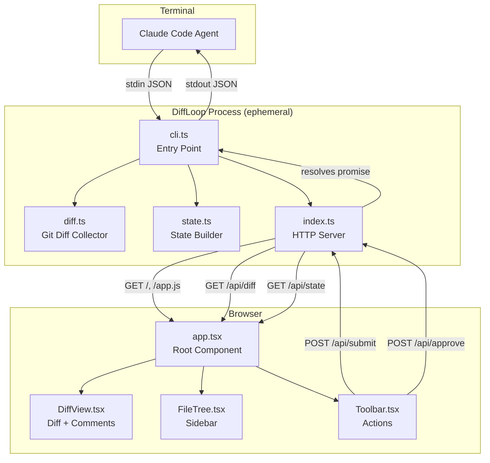
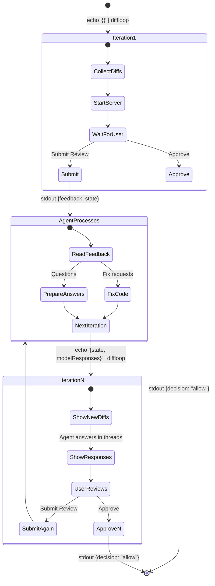
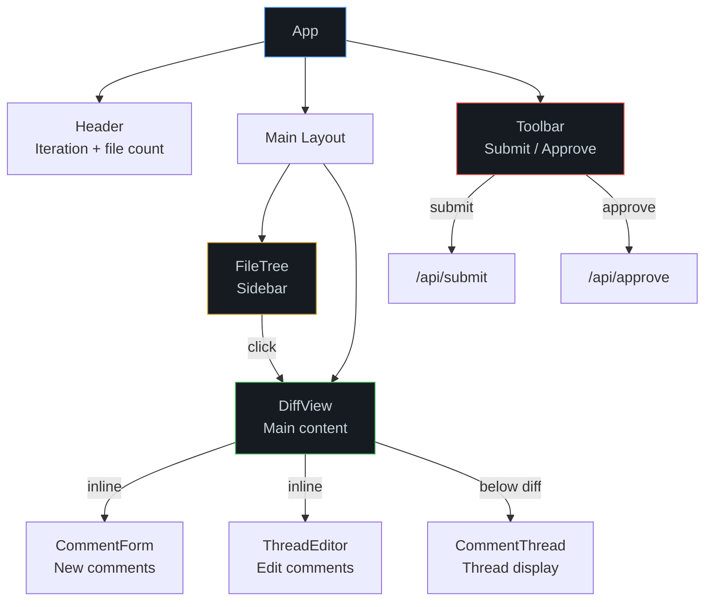
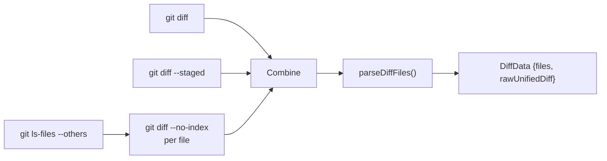

# Architecture

## Overview

DiffLoop is an ephemeral review server. Each invocation is a short-lived process:

1. Read input from stdin
2. Collect git diffs
3. Start HTTP server
4. Wait for user decision
5. Write output to stdout
6. Exit

No database, no persistent state. State flows through stdin/stdout JSON between iterations.

## System Diagram



## Review Loop Flow



## Component Architecture



## Data Flow

### Stdin → State

```
StdinInput {
  state?: ReviewState        ← previous iteration's state
  modelResponses?: [{        ← agent's answers to questions
    threadId, text
  }]
}
        │
        ▼
  buildState()
        │
        ▼
ReviewState {
  iteration: N+1             ← incremented
  threads: [                 ← preserved + responses applied
    Thread { messages: [..., {author: "model", text}] }
  ]
}
```

### State → Stdout

```
User clicks Submit Review
        │
        ▼
  formatFeedback(state)
        │
        ▼
Decision {
  decision: "deny"
  feedback: "## Fix Requests\n- **file:42** — change X to Y\n..."
  state: ReviewState         ← for next iteration
}
        │
        ▼
  stdout JSON → Claude Code reads and processes
```

## Git Diff Collection



Three sources of changes are collected in parallel:
1. **Unstaged** — `git diff`
2. **Staged** — `git diff --staged`
3. **Untracked** — `git ls-files --others` → `git diff --no-index -- /dev/null <file>`

## Thread Lifecycle

```
Create (click line → fill form → submit)
  │
  ├── Type: "fix" → Agent makes code changes
  │   └── On next iteration: user sees new diff, can verify fix
  │
  └── Type: "question" → Agent prepares answer
      └── On next iteration: model response appears in thread
          └── User can reply → new iteration → agent responds again

Edit (click 💬 indicator → ThreadEditor)
  ├── Change text
  ├── Change type (fix ↔ question)
  └── Delete

Resolve (click Resolve in thread)
  └── Thread hidden from feedback, appears dimmed
      └── Can be reopened (Unresolve)
```

## Line Selection Model

```
                    ┌─────────────────────┐
                    │  CommentTarget      │
                    │  {                  │
                    │    file: string     │
                    │    lines: number[]  │
                    │    side: "old"|"new"│
                    │  }                  │
                    └─────────────────────┘
                              ▲
                              │
         ┌────────────────────┼────────────────────┐
         │                    │                    │
    Click (single)      Shift+click          Ctrl+click
    lines: [42]         (range)              (toggle)
                        lines: [42..50]      lines: [42, 45, 48]
                              │
                              │
                        Drag (mousedown
                        → mouseenter
                        → mouseup)
                        lines: [42..50]
```

## Build Pipeline

```
src/ui/app.tsx ──► Bun.build() ──► dist/app.js (minified ESM)
                                        │
src/ui/styles.css ──────────────────────┤
diff2html.min.css ──────────────────────┤
                                        ▼
                                  dist/index.html
                                  (CSS inlined, JS external)
```

The build produces two files:
- `dist/index.html` — HTML shell with all CSS inlined
- `dist/app.js` — minified Preact bundle

The server serves both: HTML on `/`, JS on `/app.js`.
