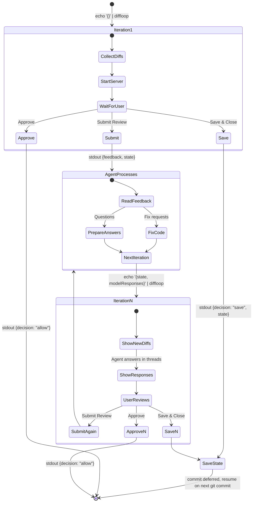
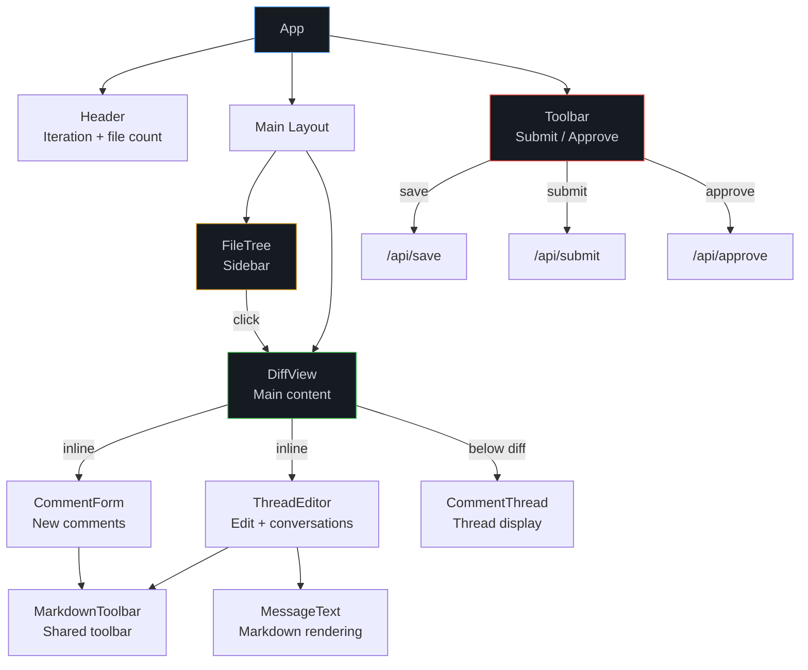

# Architecture

## Overview

DiffLoop is an ephemeral review server. Each invocation is a short-lived process:

1. Read input from stdin
2. Collect git diffs
3. Start HTTP server
4. Wait for user decision
5. Write output to stdout
6. Exit

State flows through stdin/stdout JSON between iterations. Between iterations, state is persisted in `.diffloop/<branch>/state.json` inside the project directory (gitignored), isolated per branch.

## System Diagram


## Review Loop Flow



## Component Architecture



## Data Flow

### Stdin → State

```
StdinInput {
  state?: ReviewState        ← previous iteration's state
  modelResponses?: [{        ← agent's answers to questions
    threadId, text
  }]
}
        │
        ▼
  buildState()
        │
        ▼
ReviewState {
  iteration: N+1             ← incremented
  threads: [                 ← preserved + responses applied
    Thread { messages: [..., {author: "model", text}] }
  ]
}
```

### State → Stdout

```
User clicks Submit Review
        │
        ▼
  formatFeedback(state)
        │
        ▼
Decision {
  decision: "deny"
  feedback: "## Fix Requests\n- **file:42** — change X to Y\n..."
  state: ReviewState         ← for next iteration
}
        │
        ▼
  stdout JSON → Claude Code reads and processes
```

## Git Diff Collection


Three sources of changes are collected in parallel:
1. **Unstaged** — `git diff`
2. **Staged** — `git diff --staged`
3. **Untracked** — `git ls-files --others` → `git diff --no-index -- /dev/null <file>`

## Thread Lifecycle

```
Create (click line → fill form → submit)
  │
  ├── Type: "fix" → Agent makes code changes
  │   └── On next iteration: user sees new diff, can verify fix
  │
  └── Type: "question" → Agent prepares answer
      └── On next iteration: model response appears in thread
          └── User can reply → new iteration → agent responds again

Edit (click 💬 indicator → ThreadEditor)
  ├── Change text
  ├── Change type (fix ↔ question)
  └── Delete

Resolve (click Resolve in thread)
  └── Thread hidden from feedback, appears dimmed
      └── Can be reopened (Unresolve)
```

## Line Selection Model

```
                    ┌─────────────────────┐
                    │  CommentTarget      │
                    │  {                  │
                    │    file: string     │
                    │    lines: number[]  │
                    │    side: "old"|"new"│
                    │  }                  │
                    └─────────────────────┘
                              ▲
                              │
         ┌────────────────────┼────────────────────┐
         │                    │                    │
    Click (single)      Shift+click          Ctrl+click
    lines: [42]         (range)              (toggle)
                        lines: [42..50]      lines: [42, 45, 48]
                              │
                              │
                        Drag (mousedown
                        → mouseenter
                        → mouseup)
                        lines: [42..50]
```

## Build Pipeline

```
src/ui/app.tsx ──► Bun.build() ──► dist/app.js (minified ESM)
                                        │
src/ui/styles.css ──────────────────────┤
diff2html.min.css ──────────────────────┤
                                        ▼
                                  dist/index.html
                                  (CSS inlined, JS external)
```

The build produces two files:
- `dist/index.html` — HTML shell with all CSS inlined
- `dist/app.js` — minified Preact bundle

The server serves both: HTML on `/`, JS on `/app.js`.
